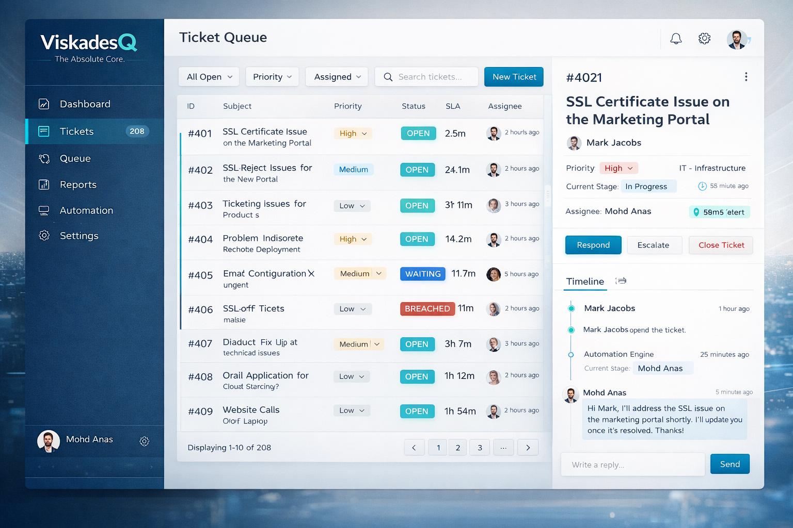
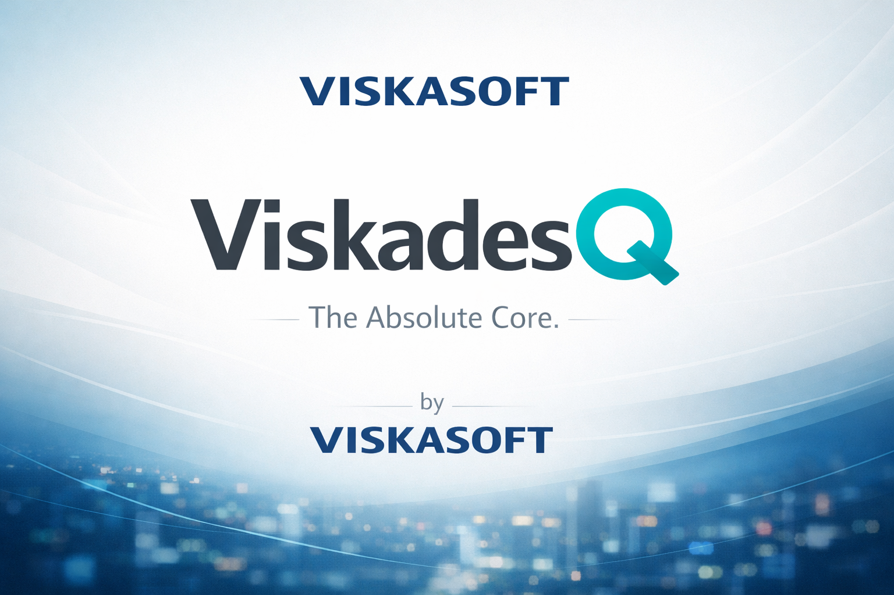

# ViskadesQ — The Absolute Core

**Product by Viskasoft**  
**First Public Release:** January 14, 2026

---

## 🎯 What is ViskadesQ?

ViskadesQ is a next-generation support ticketing system designed to act as **The Absolute Core** of customer service operations. Built with an event-driven architecture and intelligent automation, ViskadesQ transforms chaotic support queues into streamlined, decision-ready workflows.

## 🏢 Company Information

- **Company Name:** Viskasoft
- **Product Name:** ViskadesQ
- **Tagline:** The Absolute Core.
- **Founder:** Mohd Anas Iqbal Qureshi

## 🎨 Brand Identity

### Color Palette

Our interface is built on a carefully curated color system:

- **Core Blue (Primary):** `#0B3C5D` - Represents trust, stability, and professionalism
- **Quantum Cyan (Action):** `#3FD2C7` - Symbolizes innovation and decisive action
- **Deep Slate (Text):** `#1B2A36` - Ensures optimal readability
- **Soft Cloud (Background):** `#F4F7FB` - Provides a clean, airy workspace

**Dark Mode:**
- **Background:** `#0A1821`
- **Panels:** `#102733`

### Design Philosophy

ViskadesQ follows a **"Nerve Center"** design approach:
- **Clean, operational layouts** that prioritize information density without clutter
- **State-driven UI** where every element reflects real-time system state
- **Queue-based visualization** that mirrors the underlying event architecture
- **Purposeful use of Quantum Cyan** for actions and state transitions

## ✨ Key Features

### 🎯 Intelligent Ticket Management
- **Event-Driven Architecture:** Every action triggers events that flow through the system
- **Smart Assignment:** Round-robin, workload-based, and skill-based routing
- **SLA Tracking:** Real-time breach detection and escalation
- **Priority Queues:** Automatic prioritization based on business rules

### 🤖 Automation Engine
- **Rule-Based Workflows:** Define custom automation rules
- **Email Integration:** Bidirectional email sync with threading
- **Webhook Support:** Integrate with external services
- **Power Automate Integration:** Direct ingestion from Microsoft Power Automate

### 📊 Advanced Reporting
- **Real-time Dashboards:** Live metrics and KPIs
- **Custom Reports:** Filter by date, agent, pod, status
- **SLA Analytics:** Breach tracking and trend analysis
- **Audit Trails:** Complete history of all actions

### 👥 Team Collaboration
- **Role-Based Access Control:** Admin, Agent, Reporter roles
- **Pod-Based Organization:** Separate teams (Tech, Product, Sales)
- **Internal Notes:** Private communication within tickets
- **Watchers:** Subscribe to ticket updates

### 🎨 User Experience
- **3-Column Operational Layout:** Sidebar | Ticket List | Detail Panel
- **Real-Time Updates:** WebSocket-powered live notifications
- **Responsive Design:** Works seamlessly across devices
- **Dark Mode Support:** Full dark theme implementation

## 🛠️ Technology Stack

### Backend
- **Framework:** FastAPI (Python 3.11+)
- **Database:** PostgreSQL with SQLAlchemy ORM
- **Authentication:** JWT-based with bcrypt password hashing
- **Email:** SMTP with HTML templating
- **Real-Time:** WebSocket support
- **Logging:** Structured logging with structlog

### Frontend
- **Framework:** React 18+
- **Build Tool:** Vite
- **Styling:** Modern CSS with CSS Variables
- **State Management:** React Hooks
- **HTTP Client:** Axios

### Infrastructure
- **Containerization:** Docker & Docker Compose
- **Migrations:** Alembic
- **Testing:** pytest with comprehensive test suite
- **CI/CD Ready:** Environment-based configuration

## 📸 Screenshots

### Login Interface


*Clean, professional login with ViskadesQ branding*

### Main Dashboard


*3-column operational layout with live ticket queue*

### UI Preview


*Complete interface showing sidebar, ticket list, and detail panel*

## 🚀 Quick Start

### Prerequisites
- Python 3.11 or higher
- PostgreSQL 13 or higher
- Node.js 18+ (for frontend development)

### Installation

```bash
# Clone the repository
git clone https://github.com/your-username/viskadesq.git
cd viskadesq

# Run installation script (Windows)
install.bat

# Or on Linux/Mac
chmod +x install.sh
./install.sh

# Start the application
run_hybrid.bat  # Windows
# or
python run_all.py  # Cross-platform
```

Visit `http://localhost:8001` to access the application.

**Default Credentials:**
- Username: `admin`
- Password: `admin123`

## 📚 Documentation

Comprehensive documentation is available in the `docs/` directory:

- **API Documentation:** Available at `/docs` when running the application
- **Architecture Guide:** Event-driven design and system flows
- **Deployment Guide:** Production deployment instructions
- **User Manual:** Complete feature documentation

## 🏗️ Architecture

ViskadesQ is built on an **event-driven architecture** where:

1. **Events** are the source of truth for all state changes
2. **Handlers** process events and trigger appropriate actions
3. **Services** encapsulate business logic
4. **Routers** expose API endpoints
5. **Models** define data structures and database schema

This architecture ensures:
- **Auditability:** Every action is logged
- **Scalability:** Event handlers can be distributed
- **Extensibility:** New features integrate via events
- **Reliability:** Failures are isolated and recoverable

## 🔒 Security

- **JWT Authentication:** Secure token-based auth
- **Password Hashing:** bcrypt with salt
- **Role-Based Access Control:** Granular permissions
- **SQL Injection Protection:** Parameterized queries via SQLAlchemy
- **XSS Protection:** Input sanitization and output encoding
- **Audit Logging:** Complete action history

## 🤝 Contributing

ViskadesQ is currently a proprietary product by Viskasoft. For partnership inquiries or feature requests, please contact us.

## 📄 License

Copyright © 2026 Viskasoft. All rights reserved.

See [LICENSE.md](./LICENSE.md) for details.

## 📞 Contact

- **Website:** [Coming Soon]
- **Email:** [Contact Information]
- **LinkedIn:** [Viskasoft Company Page]

---

## 🎓 About Viskasoft

Viskasoft is dedicated to building enterprise-grade software solutions that serve as **The Absolute Core** of business operations. We believe in creating tools that are:

- **Operationally focused** - Built for real-world workflows
- **Event-driven** - Architected for scale and reliability
- **User-centric** - Designed with attention to UX details
- **Extensible** - Ready to grow with your business

## 🌟 Why ViskadesQ?

Traditional ticketing systems are glorified inboxes. **ViskadesQ is a decision engine.**

Every ticket flows through intelligent queues, automated rules trigger appropriate responses, SLA timers drive urgency, and teams collaborate in real-time. It's not just tracking tickets—it's orchestrating resolutions.

**ViskadesQ. The Absolute Core.**

---

*First Published: January 14, 2026*  
*This repository serves as proof of prior use and brand ownership for ViskadesQ by Viskasoft.*
